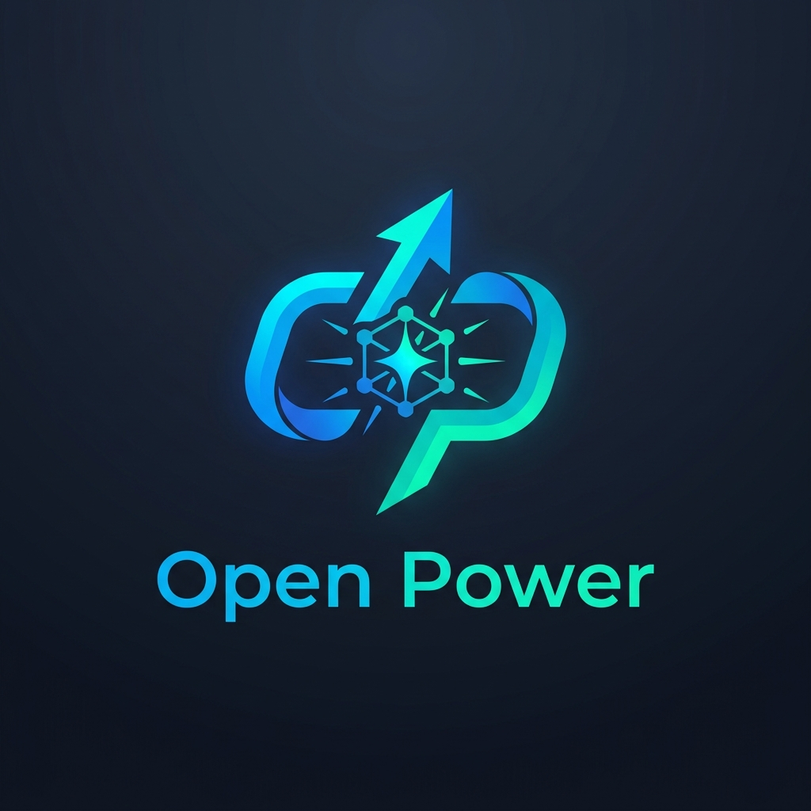

<!-- cSpell:ignore OpenPower ultraplinian parseltongue i18n openrouter -->
# Open Power

<p align="center">
	
</p>

Open Power is a multi-model AI workspace with:
- modern web UI (chat + settings + racing)
- terminal CLI (`openpower`)
- OpenRouter-backed chat and model race workflows
- advanced controls like AutoTune, Parseltongue, STM, memory, and voice typing

## Features
- Ultraplinian racing and multi-model flows
- Liquid response mode
- Light + dark themed workspace
- English/Bengali UI support
- Voice typing (desktop + mobile hold-to-talk)
- Image attachment support in standard mode

## Quick Start

### Requirements
- Node.js 18+

### Install
```bash
npm install
```

### Run Web App
Start frontend:
```bash
npm run dev
```

Start API server (separate terminal):
```bash
npm run api:dev
```

Open:
- http://localhost:3000

## Terminal CLI (`openpower`)

Link once from project root:
```bash
npm link
```

Then use:

```bash
openpower --help
openpower config
openpower config --key sk-or-v1-...
openpower config --theme power
openpower theme list
openpower model
openpower model openai/gpt-4o-mini
openpower chat "Explain vector databases"
openpower chat --model anthropic/claude-3.5-sonnet "Summarize this article"
openpower race "Compare REST vs gRPC"
openpower doctor
```

### CLI Notes
- API key is stored locally (`cli/config.json` in dev mode)
- `openpower doctor` checks local setup + API connectivity
- `openpower model` shows/sets your default chat model

### Standalone Windows EXE (Download / Build)

If you want to run Open Power CLI as a software-style `.exe`:

```bash
npm install
npm run build:cli:win
```

Output:
- `dist/openpower.exe`

Run it directly in terminal:

```powershell
.\dist\openpower.exe --help
.\dist\openpower.exe config --key sk-or-v1-...
.\dist\openpower.exe doctor
```

EXE config location:
- `%USERPROFILE%\\.openpower\\config.json`

This path is writable for packaged mode, so the EXE version works properly without editing project files.

### CLI Experience Tips
- Start with `openpower doctor`
- Set your preferred model once with `openpower model <id>`
- Use `openpower theme <name>` for cleaner terminal visuals
- For quick checks: `openpower chat "hello"`

## Documents
- API docs: [API.md](API.md)
- SRS: [SRS.md](SRS.md)
- Command reference: [docs/COMMANDS.md](docs/COMMANDS.md)
- LLM orchestration: [docs/LLM-ORCHESTRATION.md](docs/LLM-ORCHESTRATION.md)
- License overview: [docs/LICENSE-OVERVIEW.md](docs/LICENSE-OVERVIEW.md)
- Contribution guide: [CONTRIBUTING.md](CONTRIBUTING.md)
- Security policy: [SECURITY.md](SECURITY.md)

## License
- Source code: AGPL-3.0 ([LICENSE](LICENSE))
- Official binaries: [BINARY-EULA.md](BINARY-EULA.md)
